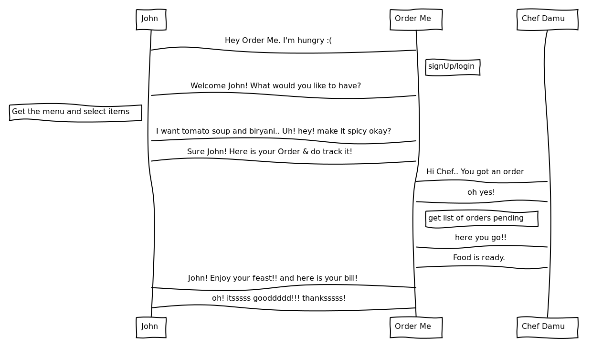

# Order.Me

Tired of taking Food Orders on paper. Use `Order.Me`!!

---
@title[Overview]

@snap[west span-50]
### What they usually do?  
Waiter -> takes order on paper -> Chef
@snapend
@snap[east span-50]

@snapend
---
@title[Freshdesk]
@snap[west span-50]
###  Freshdesk
This Supply Chain is similar to the Ticket workflow in Freshdesk. 
@snapend
@snap[east span-50]

@snapend

---
@title[Customization]

@snap[west span-50]
###  Why?
Being a SaaS product, Freshdesk cannot be customized to meet all needs.
And building a whole new website or a product is costly.

@snapend
@snap[east span-50]

@snapend

---
@title[Marketplace Apps]

@snap[west span-50]
### How?
Apps play a major role in customizing/enhancing Freshworks products.
`Order.Me` is one such example. It is a Full Page App in the Freshdesk portal to manage orders.

@snapend
@snap[east span-50]

@snapend
---
@title[Scope]
### Our Vision
Similarly, Freshdesk can be turned into a super product for Manufacturing Industries, Ecommerce business, etc., 
---
@title[App Routes]
Routes
@ul
- Selector Page : To select the user - Visitor or Chef.
- Visitor Login Page : Signup/Login page for Visitor.
- Menu Page: Visitor can select items and place the order.
- Tracker Page: Visitor can track status of the orders.
- Owner Page: Chef can view the orders placed.
@ulend

---
@title[Product Features used]

Product Functionalities Used
@ul
- V2 APIs to create/update user and ticket, filter ticket by agent/requester.
- Dispatcher to auto-assign ticket to a group & an agent.
- Custom Ticket Statuses to match the business requirement.
@ulend

---
@title[Platform Features used]

Developer platform Features Used
@ul
- Custom Installation page for collecting company information.
- 'Full_page_app' placeholder as the website.
- Few Data APIs (loggedInUser, domainName, etc.,).
- Request API to create/update tickets and contacts.
- Data persistence to store the user mapping and the order details.
@ulend
---
@title[Thank note]
Special thanks to Raghuram Periaswamy and Asif Ahmed!!!
